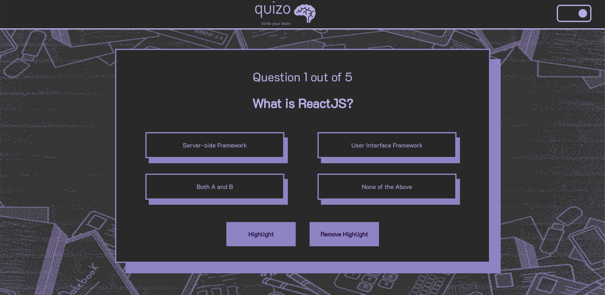

 Quizo is a cutting-edge quiz website built on the React.js framework, offering users a dynamic and engaging experience in the world of online quizzes. With its modern design and user-friendly interface, ReactQuizHub provides a seamless and enjoyable platform for its users.

Key Features:

- Theme - There are currently 2 themes present, drak Mode and Light Mode. user can switch between them on the click of a button 

- Questions highligh -  On a single button click question will turn RED making it easy for the user to read the question.

- Intuitive User Interface- The website features an intuitive user interface that makes navigation easy and enjoyable.

Screenshots

Start Page
 

Questions Page Light Mode
 
 

Questions Page Dark Mode
 
 

Results Page
 
